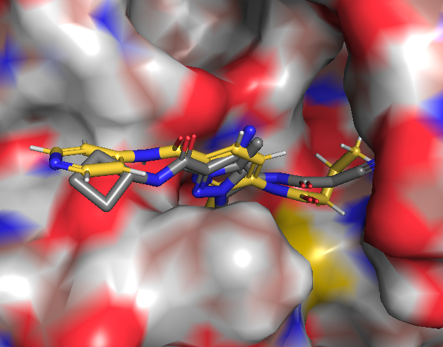

# Manual growing with FEGrow
We attempted to merge fragments x0556 and x0310 picking up all key interactions but replacing the 5 membered ring with 
a 6 member ring which had more elaborations in arthor. The reference compound had an predicted affinity of 7uM 
(gnina scoring function).

Arthor search

# Results

Using the manual grown molecule as a reference we then grew and scored each of the hits using FEGrow.

# Files

- [manual-elab.html.tar.gz](results/manual-elab.html.tar.gz): An interactive html report which can be sorted by predicted affinity or ic50(nM).
- [manual_elab_best.sdf.tar.gz](results/manual_elab_best.sdf.tar.gz): Contains the best conformers sorted 
by predicted ic50(nM).

