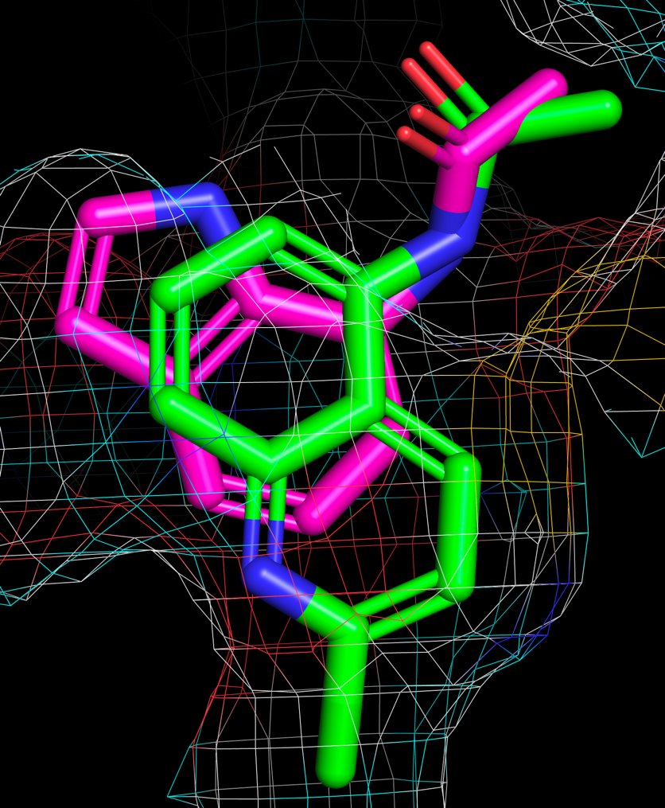

# Halo-Quinoline-Elaborations

Fegrow was used to regrow ideas from Matteo to investigate if quinoline rings could be supported in the pocket. We found
that `CC(=O)Nc1cccc2nc(Cl)ccc12` scores well and is small and is suitable for elaboration based on the [arthor](arthor.svg) search.

Arthor search 

# Results

Using `CC(=O)Nc1cccc2nc(Cl)ccc12` as our reference all arthor hits we grown and scored with FEGrow. 

## Files

- [halo_best_confs.sdf.tar.gz](results/halo_best_confs.sdf.tar.gz): Contains the best conformers sorted 
by predicted ic50(nM).
- [halo_report.html.tar.gz](results/halo_report.html.tar.gz): An interactive html report which can be sorted by predicted affinity or ic50(nM).

