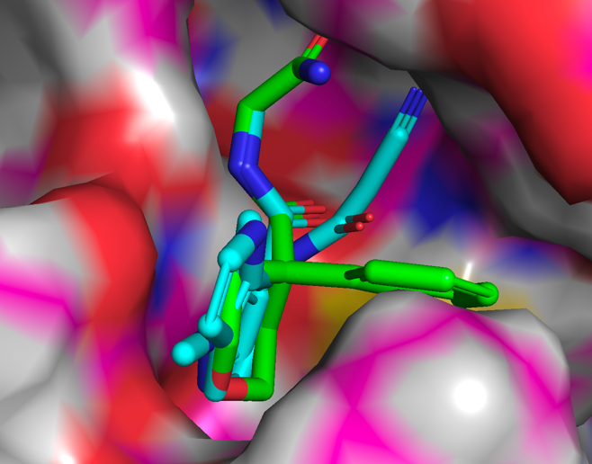

# P2 and Prime pocket vector elaborations

FEGrow was used to regrow ideas from Matteo and we found that `NC(=O)CNC(=O)C1(c2ccccc2)CCOCC1` scored well and 
offered vectors to the P2 and Prime pockets. This was used in an arthor search and the hist were scored and grown
with FEGrow.

Arthor search

# Results

Using `NC(=O)CNC(=O)C1(c2ccccc2)CCOCC1` as our reference all hits were grown and scored with FEGrow. 

# Files

- [p2_prime_best.html.tar.gz](results/p2_prime_best.html.tar.gz): An interactive html report which can be sorted by predicted affinity or ic50(nM).
- [p2_prime_best.sdf.tar.gz](results/p2_prime_best.sdf.tar.gz): Contains the best conformers sorted 
by predicted ic50(nM).